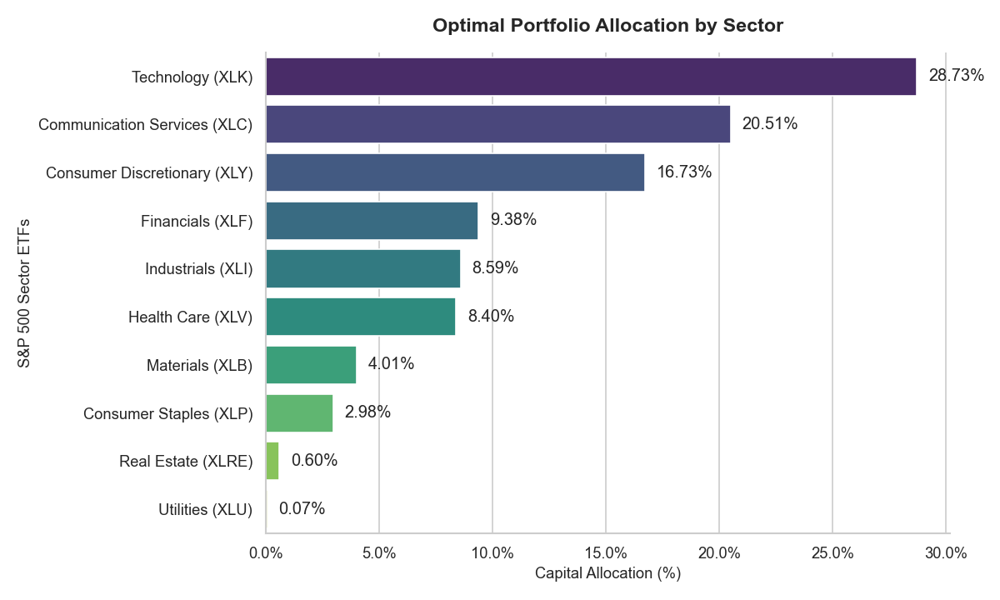

# Quantitative Portfolio Optimization: A Machine Learning Approach

## Background and Motivation
Coming from a Data Science and Engineering background, I love finding patterns in data. As I prepare to dive deeper into quantitative finance, I started studying traditional investment models, like the famous Markowitz portfolio theory. 

However, I quickly noticed a big problem: traditional models are very fragile. They rely too much on past averages. If the market changes suddenly, these models can suggest highly concentrated and risky portfolios. 

I wanted to build something better and more realistic. This project is my way of connecting two worlds: using Machine Learning to predict future market trends, and advanced financial math to manage the risk safely. It doesn't just look at what happened yesterday; it adapts to what might happen tomorrow.

## How the Project Works
Instead of trusting simple math, I built a pipeline that uses AI to create predictions and then balances them with the current market reality. The project has three main parts:

1. **Getting the Data (`data_loader.py` & `features.py`):** I wrote a script to download over 10 years of daily prices (January 1, 2015, to March 2, 2026) for 11 S&P 500 sector ETFs using Yahoo Finance. Then, I calculated key financial indicators like volatility and momentum to help the model understand the market's behavior.

2. **The Predictive Brain (`model_ml.py`):** I trained an **XGBoost** model for each sector to predict its return for the next month. I chose XGBoost because financial markets are messy, and this algorithm is great at finding complex trends without getting confused by the daily "noise". The model gives us two things: a prediction, and how confident it is about that prediction (the error rate).

3. **Managing the Risk (`optimizer.py`):** This is the final step. I used the **Black-Litterman model** to mix the current market weights with my XGBoost predictions. If the AI makes a prediction but is very uncertain, the model plays it safe and ignores it. The final result is a smart, balanced portfolio.

## Current Portfolio Allocation
Based on the latest data, here is how the algorithm suggests we should invest our money across the S&P 500 sectors:

*(You can see the code for this chart and more details in the `notebooks/01_portfolio_allocation.ipynb` file).*

## Limitations and Future Work
While this project is a solid foundation, financial markets are incredibly complex. I am aware of a few limitations that I plan to improve in the future:
* **Adding Macroeconomic Data:** Right now, the AI only looks at price movements. In the future, I want to include external factors like interest rates, inflation (CPI), and unemployment data to give the model a better understanding of the economy.
* **Testing Real-World Costs:** The current optimization assumes that buying and selling ETFs is free. I plan to add a simulation for transaction costs, taxes, and slippage to see how the portfolio survives in a real trading environment.
* **Expanding the Assets:** Currently, the model only uses US sectors. Adding government bonds, commodities like gold, or international markets would help diversify the risk even more.
* **Building a Backtester:** Instead of just looking at today's optimal weights, I want to build a loop that tests how this exact strategy would have performed month-by-month over the last 5 years.